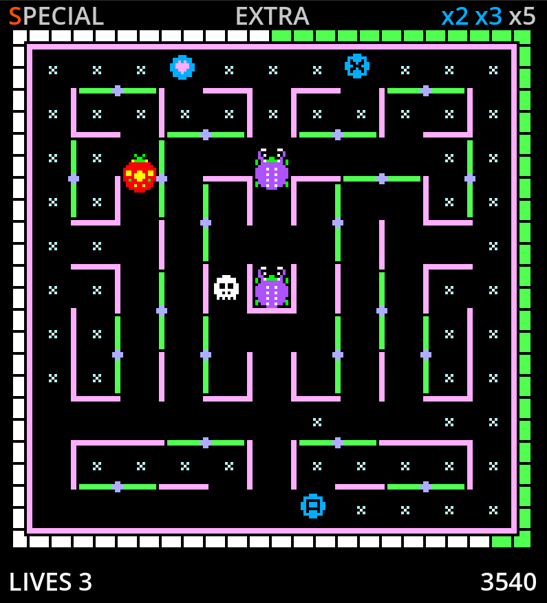

# Lady Bug Remake

A personal remake of the 1981 arcade game **Lady Bug**, built with **Godot 4.6.1 .NET** and **C#**.



## About the project

This project is an attempt to recreate the gameplay of the original arcade version of **Lady Bug** in a modern engine, while keeping the codebase readable, testable and maintainable.

The goal is not only to make a playable remake, but also to understand how the original arcade game works internally. A significant part of the project is based on reverse engineering: observing the original game in MAME, studying memory behavior, analyzing Z80 routines, comparing movement patterns, and translating arcade-era logic into modern C# systems.

The project is also heavily **AI-assisted**. I use AI as a coding and reverse-engineering partner: sometimes for precise technical analysis, sometimes in a more exploratory “vibe coding” style. The results are still manually tested, adjusted and compared against the arcade original.

## Current status

The project is currently a playable prototype.

Implemented systems include:

- maze rendering
- player movement with arcade-style assisted turns
- rotating gates
- flowers, hearts, letters and skulls
- scoring and score multipliers
- SPECIAL / EXTRA word progress
- lives and player death sequence
- enemy release through the animated border timer
- first playable enemy movement system
- level progression placeholder
- HUD with score, lives, SPECIAL, EXTRA and multipliers

Some systems are still incomplete or approximate, especially:

- bonus vegetables
- enemy freeze behavior
- exact enemy movement and decision logic
- later-level enemy rotation
- title screen and full arcade screen flow
- game over and high-score screens
- arcade-accurate transition screens

## Technology

- **Godot 4.6.1 .NET**
- **C#**
- **MAME** for observation, debugging and runtime traces
- **Ghidra** for reverse-engineering work
- **AI-assisted development**

## Reverse engineering approach

The original arcade game contains many small timing and movement details that are hard to reproduce by visual observation alone.

This remake uses a mix of:

- gameplay observation
- MAME debugger sessions
- memory inspection
- Z80 disassembly analysis
- runtime traces
- comparison with the behavior of the original arcade game
- high-level reimplementation in C#

The goal is not to reproduce the original hardware literally. Instead, the project tries to preserve the important gameplay behavior while using a cleaner and more maintainable modern architecture.

## Project structure

```text
assets/   Visual assets used by the remake
data/     JSON data for the maze and collectibles
doc/      Notes, reverse-engineering documents and implementation details
scenes/   Godot scenes
scripts/  C# gameplay and runtime code
```

## Documentation

Additional documentation is available in the `doc/` folder. It contains implementation notes and reverse-engineering material used during development.

## Disclaimer

This is a personal, non-commercial fan project made for learning, preservation and technical exploration.

**Lady Bug** is the property of its respective rights holders. This project is not affiliated with or endorsed by the original creators, publishers or rights holders.
