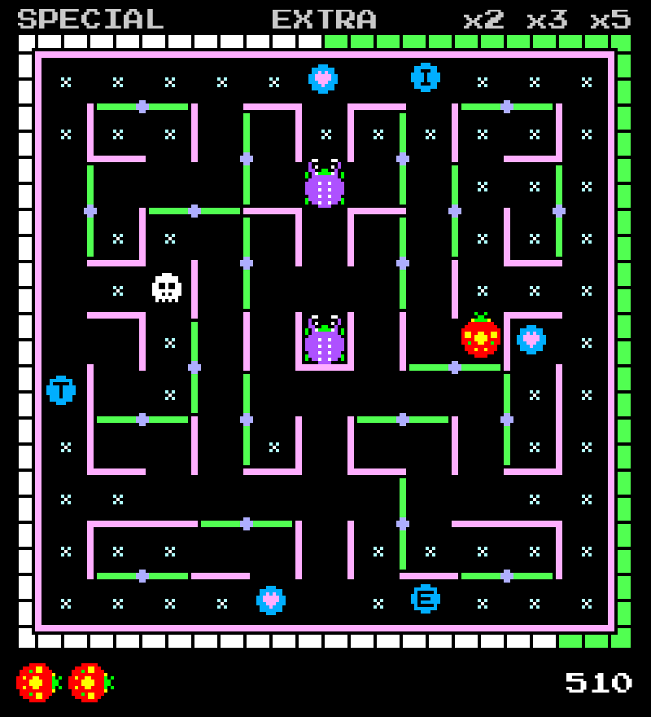

# Lady Bug Remake

A personal remake of the 1981 arcade game **Lady Bug**, built with **Godot 4.6.2 .NET** and **C#**.



## About

This project recreates the gameplay of the original arcade version of **Lady Bug** in a modern engine, while keeping the codebase readable, testable and maintainable.

The project started from a simple idea: I loved this arcade game as a kid, and I wanted to rebuild it with modern tools while preserving as much of the original gameplay feel as possible.

A large part of the work involved reverse engineering the original game: observing it in MAME, studying memory behavior, analyzing Z80 routines, comparing movement patterns, and translating arcade-era logic into modern C# systems.

The project was also heavily **AI-assisted**. AI was used as a coding and reverse-engineering partner for technical analysis, implementation ideas, refactoring, documentation and iterative development. The result was manually tested, adjusted and compared against the original arcade behavior.

## Download

The latest Windows build is available from the GitHub Releases page:

https://github.com/egofree71/LadyBug/releases

Download the Windows ZIP file, extract it, then run the executable.

## Current status

The game is currently a playable public release.

Implemented systems include:

- title screen, gameplay flow and game-over loop
- maze rendering
- player movement with arcade-style assisted turns
- rotating gates
- flowers, hearts, letters, skulls and bonus vegetables
- scoring, score multipliers and lives
- SPECIAL and EXTRA word progress
- player death sequence and life-entry animation
- enemy release through the animated border timer
- first playable enemy movement system
- enemy freeze after collecting the central bonus vegetable, while enemies remain fatal
- level progression through PART transition screens
- HUD with score, lives, SPECIAL, EXTRA and multipliers
- arcade-style typography using the Press Start 2P font
- audio cues for pickups, death, gates, enemy release, timer events and level endings

Some areas are still approximate or incomplete, including:

- high-score screens and persistence
- exact arcade transition-screen tile / color RAM rendering
- some low-level enemy movement details around rotating gates
- exact arcade coin / credit / free-game behavior

## Technology

- **Godot 4.6.2 .NET**
- **C#**
- **MAME** for observation, debugging and runtime traces
- **Ghidra** for reverse-engineering work
- **AI-assisted development**

## Reverse engineering approach

The original arcade game contains many small timing, movement and state-machine details that are hard to reproduce by visual observation alone.

This remake uses a mix of:

- gameplay observation
- MAME debugger sessions
- memory inspection
- Z80 disassembly analysis
- runtime traces
- comparison with the behavior of the original arcade game
- high-level reimplementation in C#

The goal is not to reproduce the original hardware literally. Instead, the project tries to preserve the important gameplay behavior while using a cleaner and more maintainable modern architecture.

## Project structure

```text
assets/   Visual and audio assets used by the remake
data/     JSON data for the maze and collectibles
doc/      Notes, reverse-engineering documents and implementation details
scenes/   Godot scenes
scripts/  C# gameplay and runtime code
```

## Documentation

Additional documentation is available in the `doc/` folder. It contains implementation notes and reverse-engineering material used during development.

## Disclaimer

This is a personal, non-commercial fan project made for learning, preservation and technical exploration.

**Lady Bug** is the property of its respective rights holders. This project is not affiliated with or endorsed by the original creators, publishers or rights holders.
